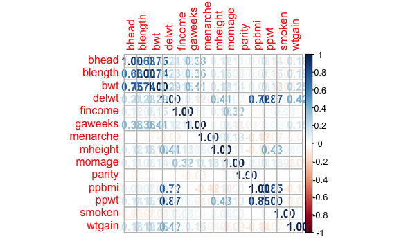
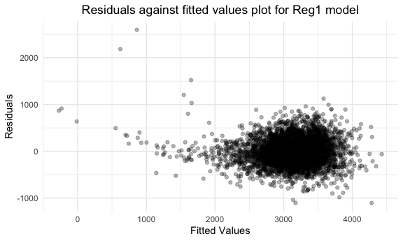
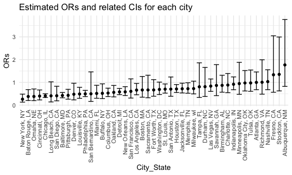
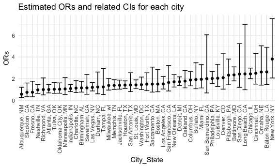

p8105_hw6_nh2706
================
Niklas Hess
2022-12-03

# Problem 1

SOLUTIONS PROVIDED!

# Problem 2

# Problem 3

### Loading and cleaning the data for regression analysis

``` r
birthweight_df = read_csv("./data/birthweight.csv") %>% 
  mutate(babysex = factor(if_else(babysex == 1, "male", "female")),
         frace = factor(recode(frace, '1' = "White", '2' = "Black", '3' = "Asian", 
                               '4' = "Puerto Rican", '8' = "Other", '9' = "Unknown")),
         mrace = factor(recode(mrace,'1' = "White", '2' = "Black", '3' = "Asian", 
                               '4' = "Puerto Rican", '8' = "Other", '9' = "Unknown")),
         malform = factor(recode(malform, '0' = "absent", '1' = "present")))
```

    ## Rows: 4342 Columns: 20
    ## ── Column specification ────────────────────────────────────────────────────────
    ## Delimiter: ","
    ## dbl (20): babysex, bhead, blength, bwt, delwt, fincome, frace, gaweeks, malf...
    ## 
    ## ℹ Use `spec()` to retrieve the full column specification for this data.
    ## ℹ Specify the column types or set `show_col_types = FALSE` to quiet this message.

``` r
sum(is.na(birthweight_df))
```

    ## [1] 0

### Proposing a regression model for birthweight

``` r
birthweight_df %>%
  select(-babysex,-frace,-malform,-mrace,-pnumlbw,-pnumsga) %>%
  cor(method = "pearson") %>%
  corrplot(method = "number")
```


First, I create a correlation table. The two variables with the highest
correlation with ‘BWT’ are ‘BHEAD’, ‘GAWEEKS’ and ‘BLENGTH’. Therefore,
I will use those three variables within my regression model.

``` r
bwt_reg1 = lm(bwt ~ blength + gaweeks + bhead, data = birthweight_df) 

bwt_reg1 %>%   
  broom::tidy() %>% 
  knitr::kable(digits = 2)
```

| term        | estimate | std.error | statistic | p.value |
|:------------|---------:|----------:|----------:|--------:|
| (Intercept) | -6195.57 |     96.35 |    -64.30 |       0 |
| blength     |    81.64 |      2.08 |     39.18 |       0 |
| gaweeks     |    14.60 |      1.51 |      9.68 |       0 |
| bhead       |   138.85 |      3.53 |     39.32 |       0 |

Second, I am constructing the linear model, including the aforementioned
variables.

``` r
birthweight_df %>% 
  modelr::add_residuals(bwt_reg1) %>% 
  modelr::add_predictions(bwt_reg1) %>% 
  ggplot(aes(x = pred, y = resid)) +
  geom_point(alpha = .3) +
  labs(title = "Residuals against fitted values plot for Reg1 model",
       x = "Fitted Values",
       y = "Residuals") +
  theme(plot.title = element_text(hjust = 0.5))
```


Third, I am showing a plot of model residuals against fitted values. The
plot shows that the linearity assumption likely holds.

### Comparing regression model to two others

#### Creating the two other models and checking their residuals vs. fitted values

Model \#2: Using length at birth and gestational age as predictors (main
effects only)

``` r
bwt_reg2 = lm(bwt ~ blength + gaweeks, data = birthweight_df) 

bwt_reg2 %>%   
  broom::tidy() %>% 
  knitr::kable(digits = 2)
```

| term        | estimate | std.error | statistic | p.value |
|:------------|---------:|----------:|----------:|--------:|
| (Intercept) | -4347.67 |     97.96 |    -44.38 |       0 |
| blength     |   128.56 |      1.99 |     64.60 |       0 |
| gaweeks     |    27.05 |      1.72 |     15.74 |       0 |

``` r
birthweight_df %>% 
  modelr::add_residuals(bwt_reg2) %>% 
  modelr::add_predictions(bwt_reg2) %>% 
  ggplot(aes(x = pred, y = resid)) +
  geom_point(alpha = .3) +
  labs(title = "Residuals against fitted values plot for Reg2 model",
       x = "Fitted Values",
       y = "Residuals") +
  theme(plot.title = element_text(hjust = 0.5))
```



Model \#3: Using head circumference, length, sex, and all interactions
(including the three-way interaction)

``` r
bwt_reg3 = lm(bwt ~ bhead + blength + babysex + bhead*blength + bhead*babysex + blength*babysex + bhead*blength*babysex, data = birthweight_df) 

bwt_reg3 %>%   
  broom::tidy() %>% 
  knitr::kable(digits = 2)
```

| term                      | estimate | std.error | statistic | p.value |
|:--------------------------|---------:|----------:|----------:|--------:|
| (Intercept)               |  -801.95 |   1102.31 |     -0.73 |    0.47 |
| bhead                     |   -16.60 |     34.09 |     -0.49 |    0.63 |
| blength                   |   -21.65 |     23.37 |     -0.93 |    0.35 |
| babysexmale               | -6374.87 |   1677.77 |     -3.80 |    0.00 |
| bhead:blength             |     3.32 |      0.71 |      4.67 |    0.00 |
| bhead:babysexmale         |   198.39 |     51.09 |      3.88 |    0.00 |
| blength:babysexmale       |   123.77 |     35.12 |      3.52 |    0.00 |
| bhead:blength:babysexmale |    -3.88 |      1.06 |     -3.67 |    0.00 |

``` r
birthweight_df %>% 
  modelr::add_residuals(bwt_reg3) %>% 
  modelr::add_predictions(bwt_reg3) %>% 
  ggplot(aes(x = pred, y = resid)) +
  geom_point(alpha = .3) +
  labs(title = "Residuals against fitted values plot for Reg3 model",
       x = "Fitted Values",
       y = "Residuals") +
  theme(plot.title = element_text(hjust = 0.5))
```



#### Compariing using the cross-validated prediction error

``` r
cv_df = 
  crossv_mc(birthweight_df, 100) %>% 
  mutate(
    train = map(train, as_tibble),
    test = map(test, as_tibble)) %>% 
  mutate(
    model_bwt_reg1 = 
      map(train, ~lm(bwt ~ blength + gaweeks + bhead, data = birthweight_df)),
    model_bwt_reg2 = 
      map(train, ~lm(bwt ~ blength + gaweeks, data = birthweight_df)),
    model_bwt_reg3 = 
      map(train, ~lm(bwt ~ bhead + blength + babysex + bhead*blength + bhead*babysex + blength*babysex + bhead*blength*babysex, data = birthweight_df))
  ) %>% 
  mutate(
    rmse_bwt_reg1 = map2_dbl(model_bwt_reg1, test, ~rmse(model = .x, data = .y)),
    rmse_bwt_reg2 = map2_dbl(model_bwt_reg2, test, ~rmse(model = .x, data = .y)),
    rmse_bwt_reg3 = map2_dbl(model_bwt_reg3, test, ~rmse(model = .x, data = .y))
  )
  
cv_df %>% 
  select(starts_with("rmse")) %>% 
  pivot_longer(
    everything(),
    names_to = "model", 
    values_to = "rmse",
    names_prefix = "rmse_bwt_reg") %>% 
  mutate(model = fct_inorder(model)) %>% 
  ggplot(aes(x = model, y = rmse)) + geom_violin() +
  labs(
    title = "RMSE values for three candidate model",
    x = "Model",
    y = "RMSEs"
  ) +
  theme(plot.title = element_text(hjust = 0.5))
```


