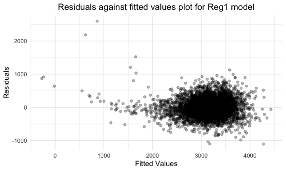
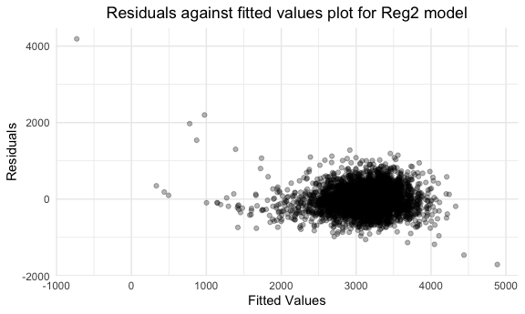
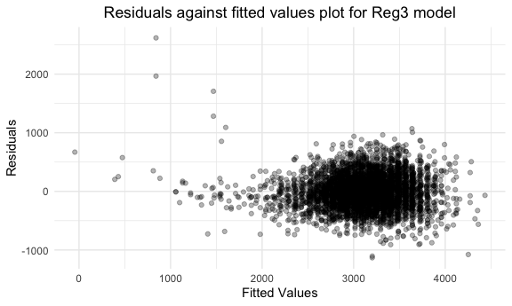
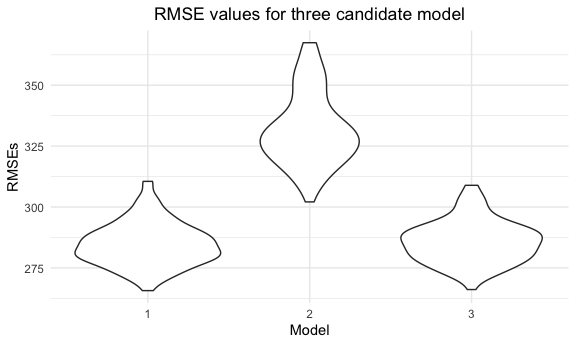

p8105_hw6_nh2706
================
Niklas Hess
2022-12-03

# Problem 1

SOLUTIONS PROVIDED!

# Problem 2

### Import and cleaning

Importing the data and cleaning it per instructions.

``` r
raw_homicide_df = read_csv("./data/homicide-data.csv", na = c("","Unknown"))
```

    ## Rows: 52179 Columns: 12
    ## ── Column specification ────────────────────────────────────────────────────────
    ## Delimiter: ","
    ## chr (8): uid, victim_last, victim_first, victim_race, victim_sex, city, stat...
    ## dbl (4): reported_date, victim_age, lat, lon
    ## 
    ## ℹ Use `spec()` to retrieve the full column specification for this data.
    ## ℹ Specify the column types or set `show_col_types = FALSE` to quiet this message.

``` r
homicide_df = raw_homicide_df %>%
  mutate(city_state = str_c(city, state, sep = ", ")) %>%
  filter(city_state != "Dallas, TX",
         city_state != "Phoenix, AZ",
         city_state != "Kansas City, MO",
         city_state != "Tulsa, AL",
         victim_race %in%  c("Black", "White")
        ) %>%
  mutate(solution = as.numeric(disposition == "Closed by arrest"),
         victim_age = as.numeric(victim_age),
         victim_race = as.numeric(victim_race == "White"),
         victim_sex = as.numeric(victim_sex == "Female"))
```

### Baltimore Analysis

First, using the glm function to fit a logistic regression with resolved
vs unresolved as the outcome and victim age, sex and race as predictors
for Baltimore. Saving the output as an object.

``` r
baltimore_df = homicide_df %>%
  filter(city == "Baltimore") %>%
  glm(solution ~ victim_age + victim_race + victim_sex, data = ., family = binomial()) %>%
  saveRDS(file = "data/baltimore_glm.rds")
```

Second, reading the object and showing the adjusted odds ratio (and CI)
for solving homicides comparing male victims to female victims.

``` r
readRDS(file = "data/baltimore_glm.rds") %>%
  broom::tidy(conf.int = TRUE) %>% 
  janitor::clean_names() %>%
  mutate(OR = exp(estimate),
         conf_low = exp(conf_low),
         conf_high = exp(conf_high)) %>%
  select(term, OR, conf_low, conf_high) %>% 
  filter(term == "victim_sex") %>%
  knitr::kable(digits = 3)
```

| term       |   OR | conf_low | conf_high |
|:-----------|-----:|---------:|----------:|
| victim_sex | 2.35 |    1.794 |     3.085 |

### All city analysis

Runing glm for each of the cities in your dataset, and extract the
adjusted odds ratio (and CI) for solving homicides comparing male
victims to female victims.

``` r
city_list = unique(homicide_df$city_state)

city_function = function(y){
  output = homicide_df %>%
    filter(city_state == y) %>%
    glm(solution ~ victim_age + victim_race + victim_sex, data = ., family = binomial()) %>%
    broom::tidy(conf.int = TRUE) %>% 
    janitor::clean_names() %>%
    mutate(OR = exp(estimate),
         conf_low = exp(conf_low),
         conf_high = exp(conf_high)) %>%
    filter(term == "victim_sex") %>%
    select(term, OR, conf_low, conf_high)
}

final_list = map(city_list, city_function)

df_final = data.frame(city_list[1],final_list[[1]])

names(df_final)[1] = "city_state"

for (i in 2:47) {
  df = data.frame(city_list[i],final_list[[i]])
  names(df)[1] = "city_state"
  df_final = rbind(df_final, df)
}

knitr::kable(df_final)
```

| city_state         | term       |        OR |  conf_low | conf_high |
|:-------------------|:-----------|----------:|----------:|----------:|
| Albuquerque, NM    | victim_sex | 0.5657710 | 0.2658260 |  1.212550 |
| Atlanta, GA        | victim_sex | 0.9999229 | 0.6857500 |  1.469837 |
| Baltimore, MD      | victim_sex | 2.3501115 | 1.7935586 |  3.084603 |
| Baton Rouge, LA    | victim_sex | 2.6216492 | 1.4627704 |  4.893610 |
| Birmingham, AL     | victim_sex | 1.1494051 | 0.7611272 |  1.750144 |
| Boston, MA         | victim_sex | 1.4985272 | 0.7936268 |  2.850253 |
| Buffalo, NY        | victim_sex | 1.9209697 | 1.0685701 |  3.466907 |
| Charlotte, NC      | victim_sex | 1.1313528 | 0.7191164 |  1.815726 |
| Chicago, IL        | victim_sex | 2.4384403 | 1.9965874 |  2.975099 |
| Cincinnati, OH     | victim_sex | 2.5010774 | 1.4991480 |  4.321956 |
| Columbus, OH       | victim_sex | 1.8779889 | 1.3370550 |  2.652199 |
| Denver, CO         | victim_sex | 2.0874123 | 1.0389639 |  4.296677 |
| Detroit, MI        | victim_sex | 1.7171886 | 1.3632414 |  2.164758 |
| Durham, NC         | victim_sex | 1.2309943 | 0.6031302 |  2.614776 |
| Fort Worth, TX     | victim_sex | 1.4948122 | 0.8919331 |  2.541214 |
| Fresno, CA         | victim_sex | 0.7489713 | 0.3281370 |  1.762875 |
| Houston, TX        | victim_sex | 1.4064176 | 1.1040726 |  1.795383 |
| Indianapolis, IN   | victim_sex | 1.0884610 | 0.8056032 |  1.473923 |
| Jacksonville, FL   | victim_sex | 1.3892471 | 1.0361636 |  1.865938 |
| Las Vegas, NV      | victim_sex | 1.1943039 | 0.8687453 |  1.650484 |
| Long Beach, CA     | victim_sex | 2.4377380 | 0.9763933 |  7.006215 |
| Los Angeles, CA    | victim_sex | 1.5108443 | 1.0481043 |  2.190574 |
| Louisville, KY     | victim_sex | 2.0385092 | 1.2760976 |  3.316883 |
| Memphis, TN        | victim_sex | 1.3827062 | 1.0166763 |  1.900704 |
| Miami, FL          | victim_sex | 1.9408508 | 1.1448879 |  3.289242 |
| Milwaukee, wI      | victim_sex | 1.3752649 | 0.9485599 |  2.019661 |
| Minneapolis, MN    | victim_sex | 1.0560123 | 0.5316393 |  2.101275 |
| Nashville, TN      | victim_sex | 0.9668955 | 0.6426749 |  1.468978 |
| New Orleans, LA    | victim_sex | 1.7095849 | 1.2312562 |  2.370338 |
| New York, NY       | victim_sex | 3.8110074 | 2.0618058 |  7.532888 |
| Oakland, CA        | victim_sex | 1.7759407 | 1.1532581 |  2.749201 |
| Oklahoma City, OK  | victim_sex | 1.0266153 | 0.6579068 |  1.605521 |
| Omaha, NE          | victim_sex | 2.6144741 | 1.4066051 |  5.029278 |
| Philadelphia, PA   | victim_sex | 2.0150096 | 1.5387464 |  2.659489 |
| Pittsburgh, PA     | victim_sex | 2.3215173 | 1.4377078 |  3.808041 |
| Richmond, VA       | victim_sex | 0.9939844 | 0.5015989 |  2.068393 |
| San Antonio, TX    | victim_sex | 1.4192046 | 0.8075908 |  2.545709 |
| Sacramento, CA     | victim_sex | 1.4951219 | 0.7608100 |  3.064915 |
| Savannah, GA       | victim_sex | 1.1534268 | 0.5617204 |  2.389014 |
| San Bernardino, CA | victim_sex | 1.9986235 | 0.6838085 |  6.040957 |
| San Diego, CA      | victim_sex | 2.4211621 | 1.2045513 |  5.225952 |
| San Francisco, CA  | victim_sex | 1.6459924 | 0.8656907 |  3.208290 |
| St. Louis, MO      | victim_sex | 1.4221382 | 1.0730760 |  1.887325 |
| Stockton, CA       | victim_sex | 0.7397942 | 0.3339868 |  1.598356 |
| Tampa, FL          | victim_sex | 1.2380790 | 0.5376681 |  2.945289 |
| Tulsa, OK          | victim_sex | 1.0248323 | 0.6476954 |  1.641857 |
| Washington, DC     | victim_sex | 1.4470753 | 0.9866785 |  2.146047 |

### Plotting results

Creating a plot that shows the estimated ORs and CIs for each city.
Organizing cities according to estimated OR, and comment on the plot.

``` r
city_graph = df_final %>%
  mutate(city_state = fct_reorder(city_state, OR)) %>% 
  ggplot(aes(x = city_state, y = OR)) +
  geom_point() +
  geom_errorbar(aes(ymin = conf_low, ymax = conf_high)) +
  labs(
    title = "Estimated ORs and related CIs for each city",
    x = "City_State",
    y = "ORs") +
  theme(axis.text.x = element_text(angle = 90, vjust = 0.5, hjust = 1))

city_graph
```


# Problem 3

### Loading and cleaning the data for regression analysis

``` r
birthweight_df = read_csv("./data/birthweight.csv") %>% 
  mutate(babysex = factor(if_else(babysex == 1, "male", "female")),
         frace = factor(recode(frace, '1' = "White", '2' = "Black", '3' = "Asian", 
                               '4' = "Puerto Rican", '8' = "Other", '9' = "Unknown")),
         mrace = factor(recode(mrace,'1' = "White", '2' = "Black", '3' = "Asian", 
                               '4' = "Puerto Rican", '8' = "Other", '9' = "Unknown")),
         malform = factor(recode(malform, '0' = "absent", '1' = "present")))
```

    ## Rows: 4342 Columns: 20
    ## ── Column specification ────────────────────────────────────────────────────────
    ## Delimiter: ","
    ## dbl (20): babysex, bhead, blength, bwt, delwt, fincome, frace, gaweeks, malf...
    ## 
    ## ℹ Use `spec()` to retrieve the full column specification for this data.
    ## ℹ Specify the column types or set `show_col_types = FALSE` to quiet this message.

``` r
sum(is.na(birthweight_df))
```

    ## [1] 0

### Proposing a regression model for birthweight

``` r
birthweight_df %>%
  select(-babysex,-frace,-malform,-mrace,-pnumlbw,-pnumsga) %>%
  cor(method = "pearson") %>%
  corrplot(method = "number")
```


First, I create a correlation table. The two variables with the highest
correlation with ‘BWT’ are ‘BHEAD’, ‘GAWEEKS’ and ‘BLENGTH’. Therefore,
I will use those three variables within my regression model.

``` r
bwt_reg1 = lm(bwt ~ blength + gaweeks + bhead, data = birthweight_df) 

bwt_reg1 %>%   
  broom::tidy() %>% 
  knitr::kable(digits = 2)
```

| term        | estimate | std.error | statistic | p.value |
|:------------|---------:|----------:|----------:|--------:|
| (Intercept) | -6195.57 |     96.35 |    -64.30 |       0 |
| blength     |    81.64 |      2.08 |     39.18 |       0 |
| gaweeks     |    14.60 |      1.51 |      9.68 |       0 |
| bhead       |   138.85 |      3.53 |     39.32 |       0 |

Second, I am constructing the linear model, including the aforementioned
variables.

``` r
birthweight_df %>% 
  modelr::add_residuals(bwt_reg1) %>% 
  modelr::add_predictions(bwt_reg1) %>% 
  ggplot(aes(x = pred, y = resid)) +
  geom_point(alpha = .3) +
  labs(title = "Residuals against fitted values plot for Reg1 model",
       x = "Fitted Values",
       y = "Residuals") +
  theme(plot.title = element_text(hjust = 0.5))
```


Third, I am showing a plot of model residuals against fitted values. The
plot shows that the linearity assumption likely holds.

### Comparing regression model to two others

#### Creating the two other models and checking their residuals vs. fitted values

Model \#2: Using length at birth and gestational age as predictors (main
effects only)

``` r
bwt_reg2 = lm(bwt ~ blength + gaweeks, data = birthweight_df) 

bwt_reg2 %>%   
  broom::tidy() %>% 
  knitr::kable(digits = 2)
```

| term        | estimate | std.error | statistic | p.value |
|:------------|---------:|----------:|----------:|--------:|
| (Intercept) | -4347.67 |     97.96 |    -44.38 |       0 |
| blength     |   128.56 |      1.99 |     64.60 |       0 |
| gaweeks     |    27.05 |      1.72 |     15.74 |       0 |

``` r
birthweight_df %>% 
  modelr::add_residuals(bwt_reg2) %>% 
  modelr::add_predictions(bwt_reg2) %>% 
  ggplot(aes(x = pred, y = resid)) +
  geom_point(alpha = .3) +
  labs(title = "Residuals against fitted values plot for Reg2 model",
       x = "Fitted Values",
       y = "Residuals") +
  theme(plot.title = element_text(hjust = 0.5))
```



Model \#3: Using head circumference, length, sex, and all interactions
(including the three-way interaction)

``` r
bwt_reg3 = lm(bwt ~ bhead + blength + babysex + bhead*blength + bhead*babysex + blength*babysex + bhead*blength*babysex, data = birthweight_df) 

bwt_reg3 %>%   
  broom::tidy() %>% 
  knitr::kable(digits = 2)
```

| term                      | estimate | std.error | statistic | p.value |
|:--------------------------|---------:|----------:|----------:|--------:|
| (Intercept)               |  -801.95 |   1102.31 |     -0.73 |    0.47 |
| bhead                     |   -16.60 |     34.09 |     -0.49 |    0.63 |
| blength                   |   -21.65 |     23.37 |     -0.93 |    0.35 |
| babysexmale               | -6374.87 |   1677.77 |     -3.80 |    0.00 |
| bhead:blength             |     3.32 |      0.71 |      4.67 |    0.00 |
| bhead:babysexmale         |   198.39 |     51.09 |      3.88 |    0.00 |
| blength:babysexmale       |   123.77 |     35.12 |      3.52 |    0.00 |
| bhead:blength:babysexmale |    -3.88 |      1.06 |     -3.67 |    0.00 |

``` r
birthweight_df %>% 
  modelr::add_residuals(bwt_reg3) %>% 
  modelr::add_predictions(bwt_reg3) %>% 
  ggplot(aes(x = pred, y = resid)) +
  geom_point(alpha = .3) +
  labs(title = "Residuals against fitted values plot for Reg3 model",
       x = "Fitted Values",
       y = "Residuals") +
  theme(plot.title = element_text(hjust = 0.5))
```



#### Compariing using the cross-validated prediction error

``` r
cv_df = 
  crossv_mc(birthweight_df, 100) %>% 
  mutate(
    train = map(train, as_tibble),
    test = map(test, as_tibble)) %>% 
  mutate(
    model_bwt_reg1 = 
      map(train, ~lm(bwt ~ blength + gaweeks + bhead, data = birthweight_df)),
    model_bwt_reg2 = 
      map(train, ~lm(bwt ~ blength + gaweeks, data = birthweight_df)),
    model_bwt_reg3 = 
      map(train, ~lm(bwt ~ bhead + blength + babysex + bhead*blength + bhead*babysex + blength*babysex + bhead*blength*babysex, data = birthweight_df))
  ) %>% 
  mutate(
    rmse_bwt_reg1 = map2_dbl(model_bwt_reg1, test, ~rmse(model = .x, data = .y)),
    rmse_bwt_reg2 = map2_dbl(model_bwt_reg2, test, ~rmse(model = .x, data = .y)),
    rmse_bwt_reg3 = map2_dbl(model_bwt_reg3, test, ~rmse(model = .x, data = .y))
  )
  
cv_df %>% 
  select(starts_with("rmse")) %>% 
  pivot_longer(
    everything(),
    names_to = "model", 
    values_to = "rmse",
    names_prefix = "rmse_bwt_reg") %>% 
  mutate(model = fct_inorder(model)) %>% 
  ggplot(aes(x = model, y = rmse)) + geom_violin() +
  labs(
    title = "RMSE values for three candidate model",
    x = "Model",
    y = "RMSEs"
  ) +
  theme(plot.title = element_text(hjust = 0.5))
```



The violin graph above shows that model 1 and model 3 have a very
similar RMSE score. As such, it would require some further investigation
to decide which model is the best. Nevertheless, model 2 has a very high
RMSE score and can be excluded.

# END
